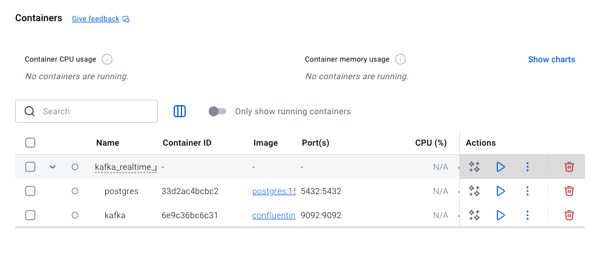
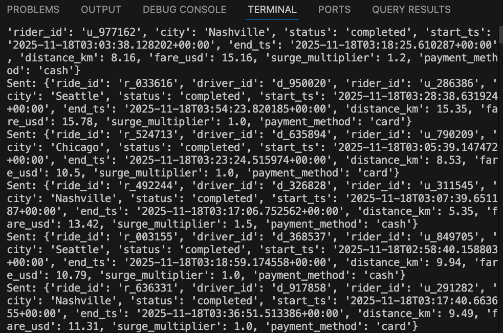
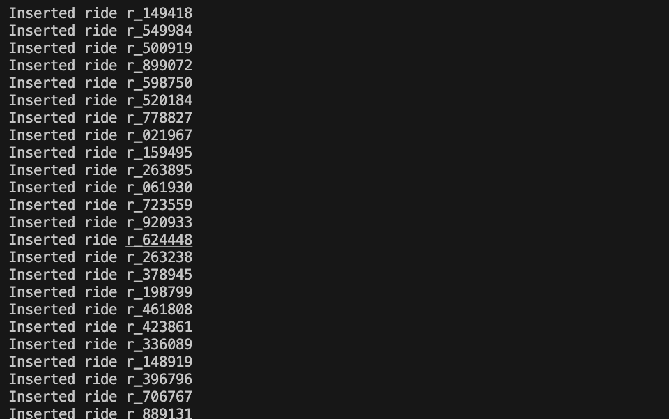
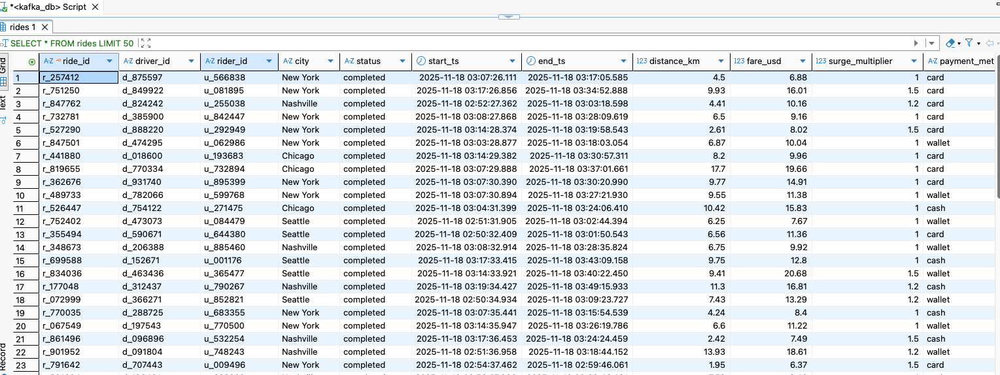
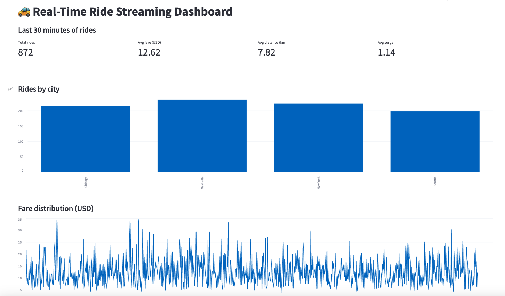

# IDS706_DE_Kafka

# Real-Time Ride-Sharing Streaming Pipeline

This project implements a complete real-time data streaming pipeline using Apache Kafka, PostgreSQL, and Streamlit. Synthetic ride-sharing trip events are generated in Python, streamed through Kafka, consumed and stored in PostgreSQL, and visualized in a live, auto-refreshing Streamlit dashboard.

---

## Project Overview

The goal of this project is to demonstrate a real-time data streaming system in a ride-sharing context. The pipeline works as follows:

1. Synthetic ride-sharing trip events are generated by a Kafka producer.
2. The events are sent to a Kafka topic (for example, `rides`).
3. A Kafka consumer reads events from this topic and inserts them into a PostgreSQL database.
4. A Streamlit dashboard queries the database and displays live metrics, charts, and recent trips, refreshing automatically.

## Data Description

This project uses synthetic ride-sharing trip data. Each event represents one completed ride. All trip events are synthetically generated inside the Kafka producer using Python’s random and datetime libraries.

The generator simulates realistic ride-sharing behavior—random start times, durations, distances, fares, surge pricing, and payment methods—while ensuring the dataset is entirely artificial and safe for instruction and testing.

### Event Schema

Each Kafka message is a JSON object with the following fields:

| Field            | Type      | Description                                                                 |
|------------------|-----------|-----------------------------------------------------------------------------|
| `ride_id`        | string    | Unique identifier for the ride (e.g., `r_000123`).                         |
| `driver_id`      | string    | Identifier for the driver.                                                 |
| `rider_id`       | string    | Identifier for the rider (customer).                                       |
| `city`           | string    | City where the ride occurs (e.g., Nashville, Seattle).                     |
| `status`         | string    | Ride status, for this example usually `completed`.                         |
| `start_ts`       | timestamp | Ride start time in ISO-8601 format.                                        |
| `end_ts`         | timestamp | Ride end time in ISO-8601 format.                                          |
| `distance_km`    | float     | Distance of the ride in kilometers.                                        |
| `fare_usd`       | float     | Total fare charged to the rider in USD.                                    |
| `surge_multiplier` | float   | Surge pricing multiplier (e.g., 1.0, 1.2, 1.5).                            |
| `payment_method` | string    | Payment method used (e.g., `card`, `cash`, `wallet`).                      |

### Example Event (JSON)

###

```json
{
  "ride_id": "r_000123",
  "driver_id": "d_000045",
  "rider_id": "u_001234",
  "city": "Nashville",
  "status": "completed",
  "start_ts": "2025-11-17T21:30:05Z",
  "end_ts": "2025-11-17T21:47:22Z",
  "distance_km": 8.3,
  "fare_usd": 16.75,
  "surge_multiplier": 1.2,
  "payment_method": "card"
}
```

### What did I do?
1. Set up Kafka and PostgreSQL using Docker Compose to provide the streaming and storage infrastructure.


2. Generated synthetic ride-sharing trip events and streamed them into a Kafka topic using a Python producer.


3. Built a Kafka consumer that processes incoming events and stores them in a PostgreSQL database in real time.


**PostgreSQL:**


4. Created a Streamlit dashboard that queries the database and displays live, auto-refreshing visualizations of the streaming data.



### Final Video:
[Screen recording of the real-time streaming dashboard](screenshot/record.mov)

(The file is a .mov screen recording showing the producer, consumer, and Streamlit dashboard running end-to-end.)


